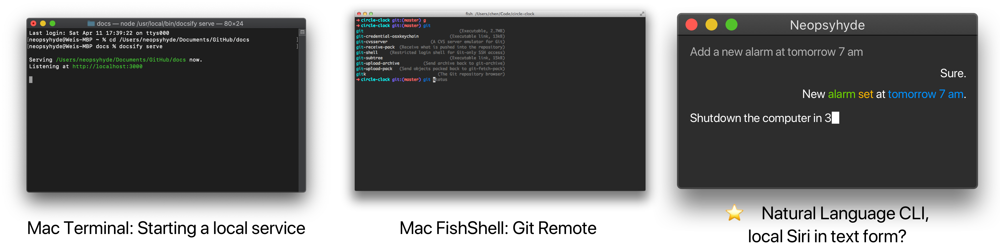
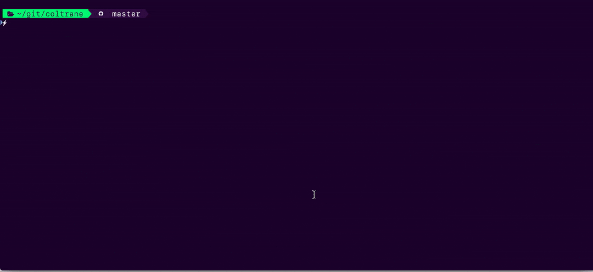
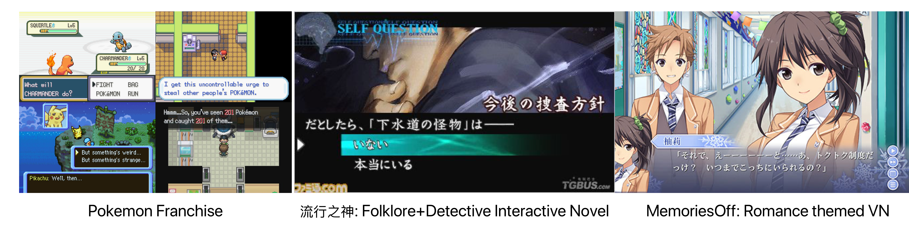
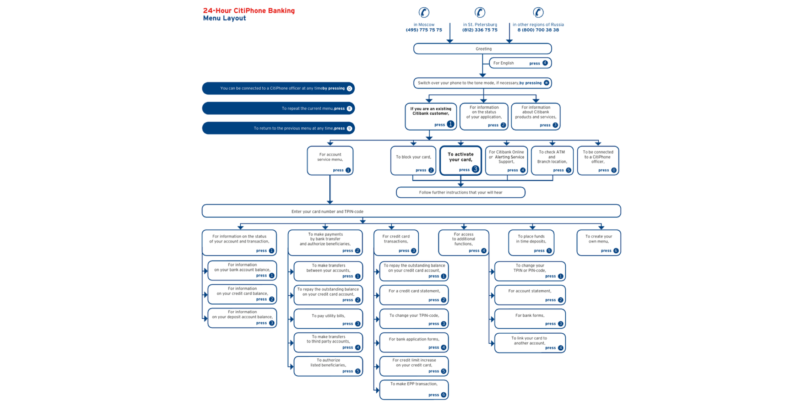
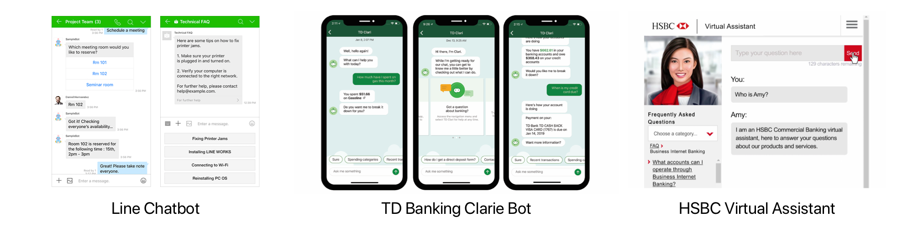
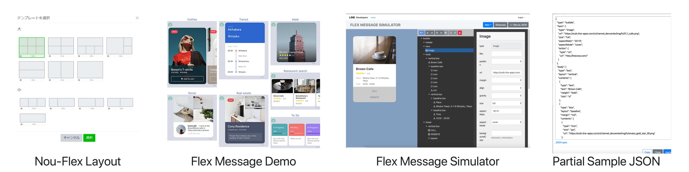
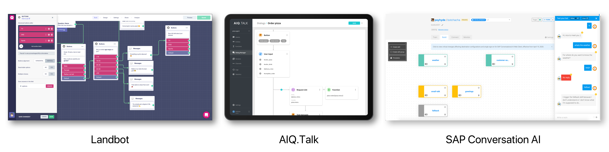
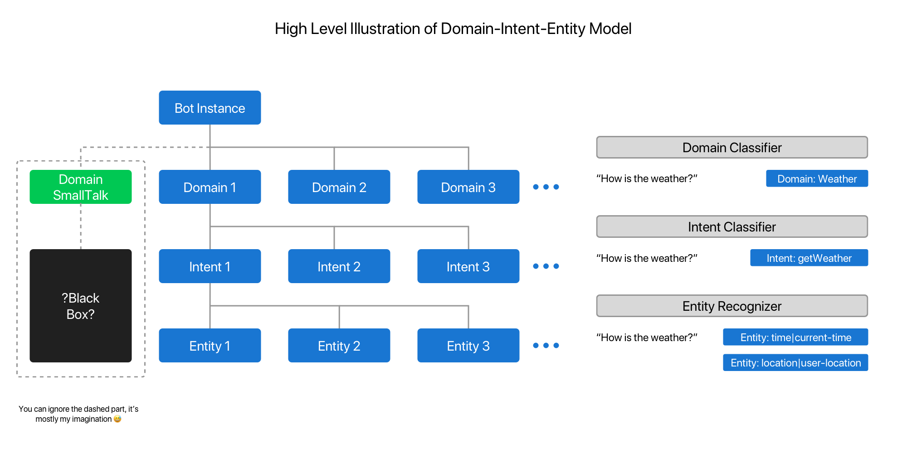

# Conversational Interaction: History, Chatbot Design Aspects, NPL Model

---
**Author: Psyhyde**

https://psyhyde.github.io/Design-Docs/#/

https://www.behance.net/hydeluo

I am going to design a set of interfaces for a chatbot visual IDE and some end-user interfaces. It's a research note for myself, to clean my vision and gather my thoughts. 

Prerequisite knowledge:  basic HCI, NLUI, Information Architecture, Interaction Design

---

## 1. History and Historic Use

### 1.1 OS Command line Interface and Application Specific CLI

Command line Interface, by its nature, carries a form of dialogic/conversational interaction. Or at least, it shares the based structure of text-based **Instruction+Feedback Flow** with chatbot UI.

Another common thing between CLI interaction and Mobile Chatbot interaction: **Absence of Mouse**.

Think about it. When interacting with a chatbot in a touchscreen mobile device, the only two scenarios that we need to use touch exclusive gestures are:

- scroll ⬆️⬇️ the whole canvas; 

- swipe ⬅️➡️ on carousel cards.

In fact, with ⬆️⬇️⬅️➡️↩️🆗  and  ⌨️, we can have a usable chatbot experience even on **Symbian OS** mobile device. 

**Operating System Command Line Interface** 



1. With features like: auto type suggestions, syntax highlighting, command history...

2. The idea of having a natural language based CLI has been brought up and failed to materialize enormous times.  

**An Application Specific Command Line Interface: Coltrane**


<small>Coltrane: A music calculation library/CLI written in Ruby</small>
https://github.com/pedrozath/coltrane


### 1.2 Game Conversational Interaction and Visual Novel


<small>(Pokemon is obviously not a conversation centered game. Just showing how much dialog and conversation could do in a low-graphic age)</small>

Conversation and dialogs in these games carry the function of:

1. Instruction-Feedback Interface;
2. Carrying story lines with text content (first person narrative, player-to-NPC dialog and 3rd-person narrative );
3. Providing holistic experience along visual, music and other aspects of game;

### 1.3 Automated Attendant

Most automated attendant systems often offer a simple **hierarchical tree menu**. It is mostly used as a filter on top of a call center system to reduce human labour and its cost. It's a **decision tree**.

- A Sample AA Dialog Script

> Thank you for calling [Company Name]. If you know your party’s extension, please dial it at any time. 
>
> - To reach our company directory, press 1
> - For more information about [Company Name], press 2
> - If you are an existing customer, please press 3
> - ...( 100 more listings )...
> - For commencing deconstruction sequence, smash your phone on the ground
> - To talk to a real human, press *(#ˆ@!*&(%$!)!*#)*!)#&!

Ring a bell? 🔔

- Example: A complete automated attendant flow


<small>https://studylib.net/doc/18272763/interactive-voice-response--ivr--menu</small>

### 1.4 Modern Business Service Bot

Most business service bots, although deployed with some sort of NLP engine, are only designed to fulfill certain tasks. They are **Control Flow** based application in chatbot form. Some are just Automated Attendants in an Instant Messenger Front-End. 

Some refer them as Retrieval-based models. Retrieval-based models are much easier to build. They also provide more predictable results. You probably won’t get 100% accuracy of responses, but at least you know all possible responses and can make sure that there are no inappropriate or grammatically incorrect responses.

However, there are a few good AA-to-Chatbot transformations.  They are deployed with Domain-Intend-Entity model and NPL engine. 




---

## 2. Chatbot Design Aspects 

There is **NO definitive term** to describe chatbot and its design pattern, nor a refined design method. UI, product and technical solution of chatbot industry are going through a rapid development stage, along with the booming of AI.

**In my definition, a conversation interaction is a back-and-forth, one way sequential information exchange activity, between two or more parties, based on one or more languages ~~that could understood by parties~~.** 

### 2.1 User Input and Bot Output/Feedback

The variety of user input and bot feedback has been vastly expanded, thanks to technical availability and development of IMs.  

#### 2.1.1 Natural Language based Conversation

In end user interface, the basic form of conversation is text and voice input/output. It is not **natural language to computer language parser**. It is based on **trigger-word-detection model**. 

#### 2.1.2 Other Forms of Input/Output:

- User Input
	- Image 
	- Video 
	- File 
	- Input via UI Card
- Bot Output (It really depands on how you design your UI Elements)
	- Button
	- Image 
	- Video 
	- Music
	- File
	- List
	- Location
	- External Link
	- ...
	- UI card that **Encapsulates** one or more UI elements
	- Variation 

A practical way for designing end-user chatbot is to integrate conversation flow with existing UI elements on IM's interface. 

### 2.2 Front-End Channel of Chatbot

Directing users to an external page usually increase use complexity and lower user experience. That is why we need to have all the UI elements encapsulated in UI cards and presented in an IM's chat-flow canvas. 

Web Integration is easy. 

It's a lot more complicated to enter an IM platform. There is not only about front-end framework, API, integration, but also corporate strategy, monopoly and sometimes even national protectionism. <small>(You know the drill)</small>

#### 2.2.1 Taking **Line** as example

Line's Chat-flow canvas is the closet thing to my imagery. It has following message types:
- Text message
- Sticker message
- Image message
- Video message
- Audio message
- Location message
- Imagemap message
- Template message
- **Flex Message**

Flex Messages are messages with a customizable layout. You can customize the layout freely based on the specification for CSS Flexible Box 


https://developers.line.biz/en/docs/messaging-api/using-flex-messages/


### 2.3 Chatbot Visual IDE 

A chatbot visual IDE is the core front-end of a chatbot platform. It is the interface for UX, system admin and operation level personnel to design scripts and make configuration.

Visual IDEs are often referred as:

`Low-code IDE - Visual/Graphic IDE - Builder - Scripting Tool - Configurator - Admin Portal`

From left to right, the complexity, customizability and use difficulty drop.

**Some example of graphic IDE for chatbot**<br/>


<small>https://landbot.io/</small><br/>
<small>https://www.skelterlabs.com/conversational-ai/</small><br/>
<small>https://cai.tools.sap/</small><br/>

<small>I have preliminary design now, but I am not gonna elaborate in this article.</small>

---
## 3. Design within NPL Model

### 3.1 Rule-based model

Like I mention in [1.4](#1.4-modern-business-service-bot), Rule-based model are control flow with internal logic and pre-defined I/O utterance or button. 

In addition, rule-based model can also fit into **state-machine** model, with **interpreted user utterance** as input, pre-defined sets of **decision trees**, context.  

### 3.2 Domain-Intent-Entity Model

Domain-Intent-Entity model is the predominant model.
<small>("Domain" are often referred as "Topic" or "Ability")</small>

To model and understand natural language, every conversational application relies on a hierarchy of machine learning classifiers. This family of machine learning models, broadly defined as the Natural Language Processing (NLP) component of an application, sits at the core of all conversational assistants in widespread production use today. While there are many different ways that machine learning techniques can be enlisted to dissect and understand human language, a set of best practices has emerged in recent years to systematize the sometimes challenging task of building accurate and useful natural language processing systems. 



Some platforms implement **4-tier Domain-Intent-Entity-Role**. **Role** is used to further describe Entity. A Role Classifier is used when an Entity can be interpreted differently. For example:

- For utterance "*Check route from 1234 Youge Street to 4321 Queen Street.*", a YAML script will be like: 

```YAML
Domain: traffic
Intent: getRoute
Entity:  
  - Role: departure
    location: "1234 Youge Street"
  - Role: destination
    location: "4321 Queen Stree"	
```
<small>You can total model the above structure with two entities, departuteLocation, destinationLocation. </small>

Some other models use **Composite Entity**.

- For utterance "*Show me all the brand new monitors that is 22 inch, 24 inch, have HDMI input, and...... Cost less than 300 cad.*", a YAML script will be like: 

```YAML
Domain: shopping 
Intent: searchProduct 
Entity: 
  ScreenSize: [22 inch, 24 inch]
  HDMI: Yes
  Condition: new
  Price:
    - Type: lessThan
      Amount: 300 
      Currency: Canadian Dollar
```
Note: these just a minimal form of data representation, you can see these as pesudo code. In real scenario, it is about how you design and label your data structure. 

After seeing ideas like **Role, Composite Entity, Entity Type, Entity Describer**, etc, I sense a trend of stacking NPL model complexity into entity tier. 

### 3.3 Conversation Flow

**Conversation Flow Diagram** (CFM) is the tool for visually define user input, bot feedback, system state, control flow. It is a sketch for your user experience. 

CFM is not so different from an application information architecture. There is no industrial standard about how you should draw your CFM. My personal approach is to draw inspiration from **Control Flow diagram**, UML **Sequence Diagram**, **Activity Diagram**, **Communication Diagram**, and **Interaction Overview Diagram**. UML is not hard to learn, but complicated to use. Its value as handoffs is quite low. It's almost a lost craft these days. 

For Rule based Design:

1. As long as you denote all the interaction and control condition, you can draw how ever you what; you can even include UI in it.

For Intent-Entity Model Design:
1. Start on **user perspective** side, draw a complete user flow, then section it by intents 
2. Switch to **system perspective**, Mapping out all intents; If necessary, use domains to group intents
3. Denote the condition of control nodes
4. For intents with multi-turn conversation, divide a complete flow into scenes 
5. It is recommend to have a data dictionary or ERD of the business system, so that you denote the data I/O correctly. 

---

## 4. Thoughts on Conversational Interaction

The general public's understanding to a Human-AI relationship is largely based on a human-like-AI concept, or at least AI with human-like interaction style. Being conversational is one of the traits. The imagery and expectation of interacting with a AI Bot, has been heavily influenced by cinematic and literature portray.  

As I mentioned, there have been different kinds of user interfaces adopting conversational interaction. Our main stream HCI are 

1. PC: GUI + Keyboard Mouse  
2. Mobile: TouchScreen based GUI 

This paradigm is more efficient and less error prone. To be honest, the experience to interact with most chatbots is not alway desirable. Even if we had a chatbot with human-like natural language understanding ability and magically connected onto a powerful back-end, it still won't change GUI's dominance in production scenario. Unless, it's automation or intelligence become productivity, per se. 

The adaptation of conversational interaction should focus on creating immersive and personalized experience, or integrate onto smart devices that inherently different interaction pattern than PC/Mobile. 


---

## Reference & Inspiration

**Guideline and Documentation:**

1.  [Google Conversation Design](https://designguidelines.withgoogle.com/conversation/conversation-design/welcome.html#)
2.  [Microsoft Language Understanding (LUIS) documentation](https://docs.microsoft.com/en-us/azure/cognitive-services/luis/) 👍
3.  [IBM Watson](https://www.ibm.com/cloud/watson-assistant/)
4.  [Cisco Mindmeld: The Conversational AI Playbook](https://www.mindmeld.com/docs/index.html) 👍
5.  [Rasa docs](https://rasa.com/docs/) 👍

**Visual IDE, Builder, Configurator:**

1. Facebook Messenger Bot Builder
2. Wit.ai Interface from Twitter
3. Flow.ai Bot Builder
4. SAP Conversational AI
5. Landbot web bot builder
6. Line Bot Designer
7. Chatbot.com

**A ton of Googling** 

---

**More Projects:**

https://psyhyde.github.io/Design-Docs/#/

https://www.behance.net/hydeluo