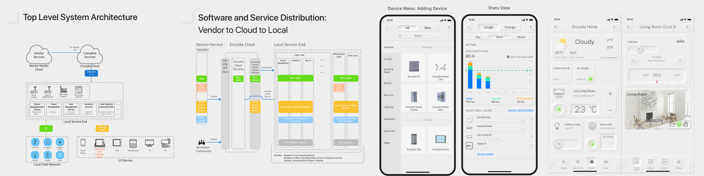
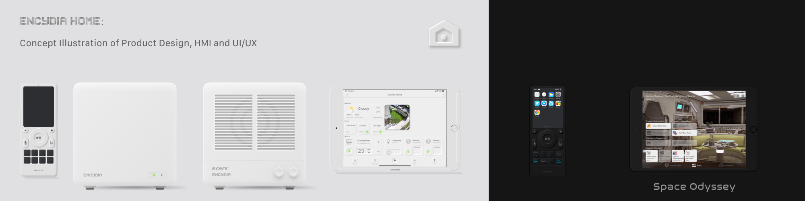
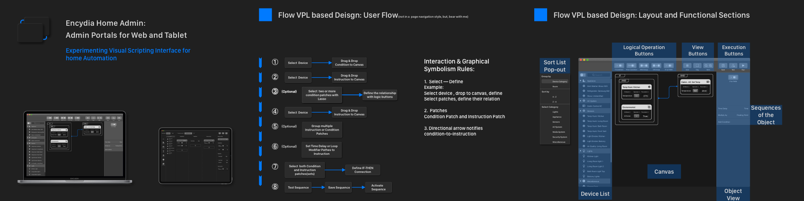

# About Me 
I am Psyhyde, UX Designer and Business Analyst.

Wechat ID: psyhydex

<small> psyhydeluo@gmail.com </small> ; <small> psyhyde@163.com</small>

## Recent Projects
 
> [!TIP|label:Posts]
> - [Encydia Smart Home Design](/SmartHome/Encydia_Home_Analysis_Concept_Architecture_UIUX_Design.md) <small>2019-12 </small> 	
> - [Encydia Smart Home Device Design](/SmartHome/Encydia_Home_Analysis_Concept_Architecture_UIUX_Design.md) <small>2020-01 </small>
> - [Encydia Visual Automation Builder](/SmartHome/Encydia_Home_Analysis_Concept_Architecture_UIUX_Design.md) <small>2020-02 </small> 
> - [Encydia Home Concise Illustration ⭐️](/SmartHome/Encydia-Home-Concise-Illustration.md) <small>2020-03 </small>
> - [Graphic Workflow Builder](/IDE/Encydia_Home_Analysis_Concept_Architecture_UIUX_Design.md) <small>2020-04 </small>   
> <!-- TIP:end -->

## Content Table

### Smart Home Design
- [Encydia Smart Home Design](/SmartHome/Encydia_Home_Analysis_Concept_Architecture_UIUX_Design.md) <small>2019-12 </small>

- [Encydia Smart Home Device Design](/SmartHome/Encydia_Home_Analysis_Concept_Architecture_UIUX_Design.md) <small>2020-01 </small>

- [Encydia Visual Automation Builder](/SmartHome/Encydia_Home_Analysis_Concept_Architecture_UIUX_Design.md) <small>2020-02 </small> 

- [Encydia Home Concise Illustration](/SmartHome/Encydia-Home-Concise-Illustration.md) <small>2020-03 </small>   

### IDE GUI Design
- [Low Code IDE Research & Analysis](/IDE/Encydia_Home_Analysis_Concept_Architecture_UIUX_Design.md) <small>2020-03 </small> 
- [App Maker Platform Top Level Design](/IDE/Encydia_Home_Analysis_Concept_Architecture_UIUX_Design.md) <small>2020-05 </small> 
- [Graphic Workflow Builder](/IDE/Encydia_Home_Analysis_Concept_Architecture_UIUX_Design.md) <small>2020-04 </small> 

### Consumer Application
- [Encydia Smart Home Design](/SmartHome/Encydia_Home_Analysis_Concept_Architecture_UIUX_Design.md) <small>2019-12 </small> 

### UX Methodology 
- [Encydia Smart Home Design](/SmartHome/Encydia_Home_Analysis_Concept_Architecture_UIUX_Design.md) <small>2018 </small> 

### System Design Methodolgies 
- [UML 2.0 Tutorial]() <small>2013 </small> 
- [System Design Principles]() <small>2013 </small>

### Past Work Projects 💼
- [西安电子政务，华数传媒]() <small>2019-06 to 2019-09 </small> 
- [Mobile Car Inquiry App, TD Banking Group]() <small>2017-11 to 2018-06 </small> 
- [Digital Wallet Mobile App, TD Banking Group]() <small>2017-05 to 2018-10 </small> 
- [Insurance CRM, TD Banking Group]() <small>2017-05 to 2018-10 </small> 

### Other Rss

- [Encydia Smart Home Design](Other) <small>2019-12 </small> 