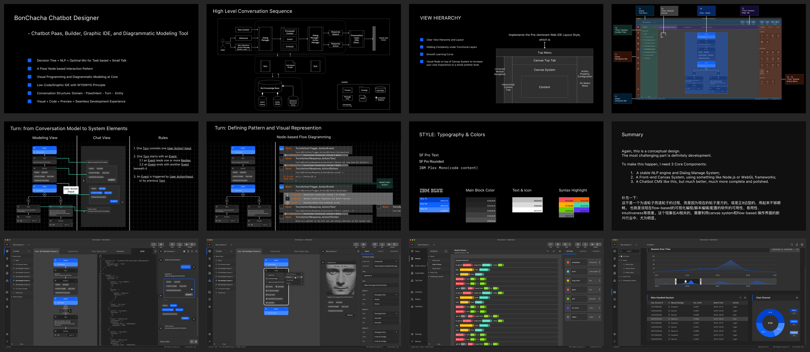
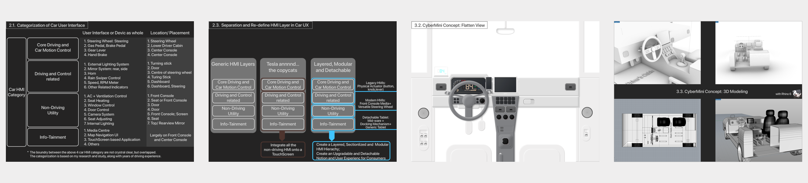

# About Me 
I am Psyhyde, UX Designer and Business Analyst.

Wechat ID: psyhydex

<small> psyhydeluo@gmail.com </small> ; <small> psyhyde@163.com</small>

## Recent Projects
 
> [!TIP|label:Posts]
> - [Chatbot Visual Modeling IDE ⭐️](/Chatbot/chatbot_concise_illustration.md) <small>2020-05 </small> 
> - [Conversational Interaction: History, Chatbot Design Aspects, NPL Model ⭐️](/Chatbot/ConversationalInteractionNote.md) <small>2020-04 </small> 
> - [Encydia Home Concise Illustration ⭐️](/SmartHome/Encydia-Home-Concise-Illustration.md)   -[Bēhance](https://www.behance.net/gallery/94936929/Encydia-Home-System)<small> 2020-03 </small>
> - [Encydia Smart Home Design ⭐️](/SmartHome/Encydia_Home_Analysis_Concept_Architecture_UIUX_Design.md) <small>2019-12 </small> 	
> - [Encydia Smart Home Device Design](/SmartHome/Encydia_Home_Analysis_Concept_Architecture_UIUX_Design.md) <small>2020-01 </small>
> - [Encydia Visual Automation Builder](/SmartHome/Encydia_Home_Analysis_Concept_Architecture_UIUX_Design.md) <small>2020-02 </small> 
> - [Graphic Workflow Builder](/IDE/Encydia_Home_Analysis_Concept_Architecture_UIUX_Design.md) <small>2020-04 </small>   
> <!-- TIP:end -->

## Content Table

### Smart Home
- [Encydia Smart Home Design](/SmartHome/Encydia_Home_Analysis_Concept_Architecture_UIUX_Design.md) <small>2019-12 </small>

- [Encydia Smart Home Device Design](/SmartHome/Encydia_Home_Analysis_Concept_Architecture_UIUX_Design.md) <small>2020-01 </small>

- [Encydia Visual Automation Builder](/SmartHome/Encydia_Home_Analysis_Concept_Architecture_UIUX_Design.md) <small>2020-02 </small> 

- [Encydia Home Concise Illustration](/SmartHome/Encydia-Home-Concise-Illustration.md) <small>2020-03 </small>  

### Chatbot
- [Chatbot Visual Modeling IDE ⭐️](/Chatbot/chatbot_concise_illustration.md) <small>2020-05 </small> 

- [Conversational Interaction: History, Chatbot Design Aspects, NPL Model ⭐️](/Chatbot/ConversationalInteractionNote.md) <small>2020-04 </small> 
### IDE GUI
- [Low Code IDE Research & Analysis](/IDE/Encydia_Home_Analysis_Concept_Architecture_UIUX_Design.md) <small>2020-03 </small> 
- [App Maker Platform Top Level Design](/IDE/Encydia_Home_Analysis_Concept_Architecture_UIUX_Design.md) <small>2020-05 </small> 
- [Graphic Workflow Builder](/IDE/Encydia_Home_Analysis_Concept_Architecture_UIUX_Design.md) <small>2020-04 </small> 

### Consumer Application
- [Car Info-tainment System Research&Analysis ⭐️ Bēhance Gallery](https://www.behance.net/gallery/94978343/Random-Car-UX-and-Interface-Design) <small>2019-12 </small> 

### UX & UI Methodology 
- [Motion and Animation in UXUI](/UX/MotionAndAnimationInUXUI.md) <small>2017 </small> 
- [Web and Mobile Grid System](/UX/) <small>2018 </small> 

### System Design Methodolgy
- [UML Tutorial ⭐️](/SystemDesign/UML.md) <small>UML is almost a lost craft. I love it and wanna retain its vitality ♥️ </small> 
   
- [Workflow Analysis]() <small>20XX </small> 
- [System Design Principles]() <small>20XX </small>

### Past Work Projects 💼
- [西安电子政务，华数传媒 ]() <small>2019-06 to 2019-09 </small> 
- [Mobile Car Inquiry App, TD Banking Group ]() <small>2017-11 to 2018-06 </small> 
- [Digital Wallet Mobile App, TD Banking Group ]() <small>2017-05 to 2018-10 </small> 
- [Insurance CRM, TD Banking Group]() <small>2017-05 to 2018-10 </small> 

### Other Rss

-  <small></small> 