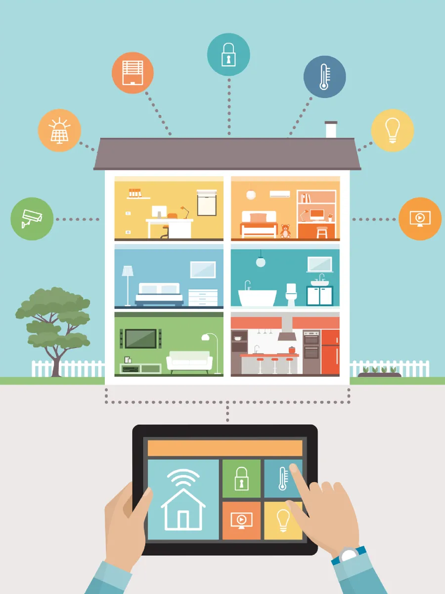
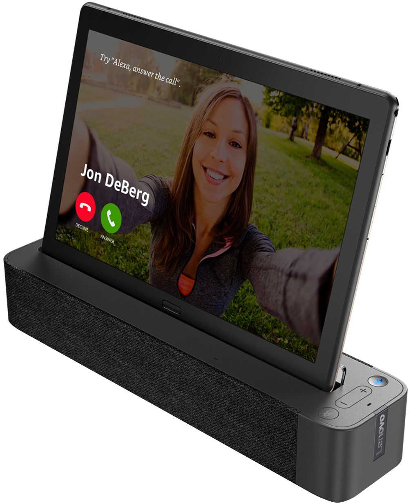
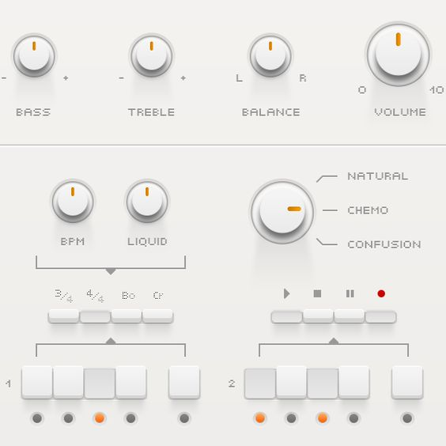
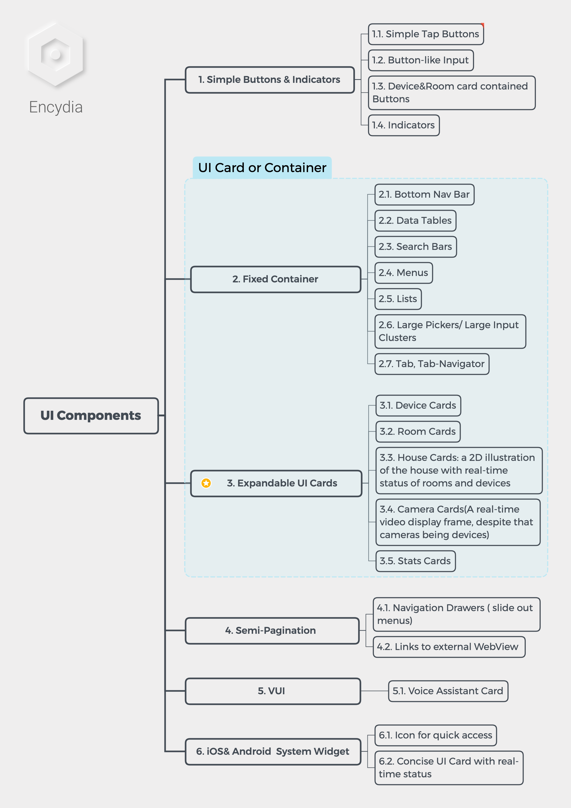

# Encydia Home: Analysis, Concept, Architecture and UX/UI Design for a Smart Home Product

**Author: Psyhyde**

**© ALL RIGHTS RESERVED**

---

**My Original Intention**

​		was to make a conceptual design for a self-sufficient smart home solution, which has a local service-end(utilizing a SBC or simpler hardware), a central network gateway to connect and control devices, along with a set of customizable UX/UI design. 

​		The problem set just kept expanding as I digging into it. 

"Encydia" was a company name and brand I meant to register back in 2015.

---

### Table of Contents

[TOC]

---

### 1. IOT and Smart Home Trend

#### 1.1. IOT is about Technology and Digitalization

IOT is a monumental and expandable concept. As for areas of applications, it includes consumer applications, commerical applications, industrial applications, infrastruture&government applications. On macro-level, IOT is generally another aspect of digitalization and even automation wave.

As for now, a full-scale digitalization of our live and societies across most aspects is still a furturistic concept, which may lead to tech-utopia/dystopia connotations. 

##### 1.1.1. Conusmer Application Obstacles

###### Consumer Market Need: not all <u>consumer need</u> can be transferred and materialized

> One simple reason: because activities that you do at home; things like eat, drink, relax, sleep, all require you to actually be there physically. Therefore they have little need for remote monitoring or remote control over the internet.
>
> Take light switches for example. Why would you need a light switch to be an IoT device? The only reason you might want to operate it is if you are already in the room, and by definition be in a position to operate it manually. One could argue that there are benefits such as theft deterrence, automation, etc. But by and large those are not sufficient for them to be mainstream at the moment.
>
> What’s stopping IoT/smart home devices from becoming mainstream is simply because the things you do at home **don’t need to be smart.**
>
> At some point, the technology will get cheap enough such that the marginal benefits outweight the costs. It’s only then when it’ll go mainstream.
>

[Yuan Gao](https://www.quora.com/profile/Yuan-Gao-5), Engineer,  Comment From Quora

###### My Opinion

> The thing is... is it worth to digitalize and integrate a device, for example, your toilt seat? And perhaps make it a add-able device for someone's smart home product or product line. 
>

###### Effort VS Value

We know <u>consumer needs</u> can be cultivated can developed. Under certain culture and market background, a set of strategies can be deployed to achieve this. 

To cultivate consumer the idea of Smart home takes the effort of the industry, communities and even governments for perhaps another 10 yrs.

For the time being, the industry shouldn't be focusing on how to "sell combs to monks", but "selling combs to young girl". In other words, focusing on tech community consumers and middle class who's looking to experience life. And, it is probably why CN industry focused on Atmospheric Light and VUI Box.

##### 1.1.2. Challenges for Consumer Applications 

As a booming industry, 

1. Consumer Need:  

2. Security and Privacy

3. Connectivity: The Pain of System Desgin and Integration 

   Device vendor, HUB vendor, unified hardware& software interface/integration

4. Compatibility and Longevity 

   For the industry is at a booming stage, software, hardware & standards get outdate rapidly. On the other hand, most appliance products are expected to be for 5-15 yrs, which is a lot longer than smart phones and PCs. Thus, vendors of HUB, connection-unit and device usually have a hard time maintain their product. 

   

#### 1.2. Fields of IOT&IOE Consumer Application

**Flat Design Illustration**

*Image Source: Internet*

##### 1.2.1. Auto: 

A new frontier along with electric car and self-driving technology. 

##### 1.2.2. Wearable Product: 

Honestly, I don't even want to mention this category. We know this industry has been around for like 30+ year, from <u>TV commercial age</u> to the current <u>mobile centered age</u>. A ton of ideas, concepts and products have been built along the way. Few of them has transformed into viable consumer products and stayed. Only till recent years, AR, VR started taking spotlight back.

> Nonetheless, shout-out and deep respect to the pioneers and evangelists of the industry.

- **Catagory listing**
  - Fitness Trackers
  - Smart Watches
  - AR, VR and related accessories
  - Medical Bio-sensor 

- **Smart Phone Centered** 
  - Quietly, today's smart phones have integrated a ton of functions and services that were throught to require additional devices, due to continuous integration and embedded sensors& modules
  - Smart phone as a ubiquitous device also serve as a HUB for connecting and controlling other smart devices from users' perspectives
  - The lowered price of making an mobile App based service: 
    - GSM - 3G - 4G
    - Server, Storage renting
    - Development of Hybrid app dev-frameworks, especially FrontEnd
    - Good supply of developers

##### 1.2.3. Traditional Security System & its Digitalization

##### 1.2.4. Smart Home:  

- Location solution: 
  - VoiceBox centered
  - Router centered
  - SmartTV: TV or Set-On-Top integration
  - Even fridge centered (Sumsang Product)

- **Voice AI: VUI**

- **Smart phone, Pad : GUI.**  

In order to pass a series of complicated instructions and even programming, a complicated interaction is needed. Natural languages are not ideal to pass a set of complicated instruction and even programming. As we know, translation from natural language to artifical language usually reduce the semantic and synatical complexity.

Therefore, the set of UI and interaction pattern that we used for smart phone device and web can be used for a GUI for smart home UI and interaction. 

Simple and spontaneous interaction: VoiceAI: VUI;

Complicated and planned interaction: traditional GUI via smartphone, pad or web;

#### 1.3. Major players in smart home industry

It seems that all the major players in the Tech industry have entered IOT realm and started building around their own product lines and strategies.

- Google: 

  Acquiring& Integrate Nest, Google Assistant, Development Framework, Developer community. 

  "风林火山", "One for All, All for One", "Just follow the lead, son ;)"

- Apple: 

  Siri was the first widely used Voice Assistant for consumer product, and now it is probably the 

- Amazon: <u>Echo</u> as VUI Voice Box and <u>Echo Show</u> GUI HUB

- Samsung: 

  Play around TV and fridge, which are two suitable places to embed "central control HUB"

  <u>S Voice</u> as their VUI

  **We Know, Giants Play Around with Top Tier Design, which are OS, Integration, Design, Ecosystem and Development& Consumer Communities**

- XiaoMi:

  XiaoMi's <u>consumer electronics</u> and well-designed appliance products are sweeping the CN consumer market. Combined with the CN consumerism culture trend, the level of development is phenomenal. 

  Not being hypercritical here, XiaoMi still largely project its imagery as a <u>consumer electronics</u> designer. Other than it VoiceAI Box and Router-gateway, XiaoMi has few smart home that can fit into <u>home automation</u> category. They are just Well designed appliance products. And don't get me wrong here, those products **ARE** well-designed and marketed. 
  
  Or perhaps, those products do not need to be connected to be smart, per se.
  
#### 1.4. Smart Home consumer product is not just about Integration and fancy features

- The imagery:  a better home living experience;

- Steps: create and demostrate your use cases and scenarios on platform, product and device levels 

  

---

### 2. Encydia Home Concept, Identity and Function

**HashTags:**

#Cloud Interoperability #Microservices #Modular Software #Single Board Computer # Software Distribution #Local Service End

#### 2.1. The core of Encydia Home:

- Paas/ B2B+P2C:
  - Provide SDK+API to 3rd party device vendors:
    - Front-End development guideline
    - Back-End Integration manual
- Emphasize Encydia platform and Encydia devices on product level
  
  - Provide customer a fully integrated smart home product line
  
- Self-sufficient Local Service End, Core ability Offline-capable 

  - Structure: Vendor Cloud - Encydia Cloud - Home Gateway + Local Host - Device Network
  - Core abilities of smart home system are handled locally
  - Cloud based service + downloadable modules for local SBC setup
  - Cloud data backup and service is available and optional
  - Better service and privacy
  - Challenge: Local Host/SBC side software

  #Cloud Interoperability #Microservices #Modular Software #Single Board Computer # Software Distribution

- Customizable UI, Integrated GUI+VUI and Personalized Experience 

  - A set of interfaces that provide user full control of the home system
  
- UIs and their bearers: 
  
  - Smartphone App
  - Pad App (a variation of app version)
  - VoiceAI box (a cloud based solution, a minimal solution) 
    - PC web interface for complicated routine setup (visual programming)
  - A steady learning curve and level of customization:
    - As OS-like application, control-feedback based, an inherent learning curve is needed
    - Preset and default setting for common use cases

#### 2.2. Conceptual Architecture and Service Distribution

- **A Conceputal Architecture**

*I made this when I felt I had a matured understanding about the problem set, with Sketch.*

- **Service Distribution: Vendor to Cloud to Local Service**

Vendors develop modular software package according to SDK/API provided from Encydia;

Vendors publish packages to Encydia; Encydia manages all packages from all vendors;

Encydia provides cloud based IOT services;

Encydia distribute software package for SBC-and-local suitable services;

- **Vendor to Cloud to Local Service**

> *I am working on another topic about Software Disturition Model across PC, Smart Phone and IOT industry.*

#### 2.3. Encydia Home System from local and end-user side of view

##### 2.3.1. Central Control Unit and its Essential Components  

A Central Control Unit = A Single Board Computer( Raspberry Pi as a viable choice) + Real-time OS (Raspbian or other suitable RTOS) + WebServer + Application

Traits:

- A local service-end for smart home system 

- A Single Board Computer as service-end, App service-end viable

- Interfaces for monitoring and controlling devices over LAN and RF

- Potential physical placement the HUB (CCU and Interfaces) : 

  - Router + Gateway: support all common <u>M2M channels and protocols</u>

  - Set-top-box or Integrated Smart TV

  - Voice AI box 

  - Smart Refrigerator (LG, Sumsang, etc.)

  - **Mount+Pad** Product (e.g. Google Nest Hub, Amazon Echo Show)
  
    In my opinion, this approach is optimal, for that:
  
    - Mobility: place and relocate to anywhere home or even carry with outdoors
    
  - Touch-sreen based GUI+VUI; thus able to carry mid-level interactions ( ref: HCI, level of interaction complexity)  
  - Mulit-Media Interface
  
    |          Google Nest Hub           |               Levono Tablet Docking Station 👍                |
    | :--------------------------------: | :----------------------------------------------------------: |
    |  |  |
    
    *Image Source: Internet*
    
    

##### 2.3.2. Encydia Home App 

- App and Web Based, Operating and Control Portal
- Interoperable Service and Multi-Service End
- Commnication layer: Gateway+relay-point can meet the requirement
- Multi-Front End:

  - A smartphone application
    - Cloud based
  - An **OS-Like** Pad application  (or a custom version of Android, if possible)
    - Cloud and Local Service
  - A Web application:
    - Cloud and Local Service
    - An environment and experience in-between sysAdmin and End-User web application
    - Emphasize on precise control and define
    - Detailed dashboard and exportable data sheet (.xml, .json .csv. etc.)
    - Possible visual programming module to enhance the customizability  
- **Diagram 4**

|                                    | Mobile App                                         | Pad App                                             | Web App                                        |
| ---------------------------------- | -------------------------------------------------- | --------------------------------------------------- | ---------------------------------------------- |
| UI Device                          | Android, iOS devices                               | Android Pad                                         | PC, Mac, Linux                                 |
| OS                                 | Android, iOS                                       | Android                                             | Browser                                        |
| Service End                        | Encydia Cloud, Vendor Cloud                        | Encydia Cloud, Vendor Cloud, Local Service End      | Encydia Cloud, Vendor Cloud, Local Service End |
| Interaction Channels               | 4-6 inches touch screen based GUI; VUI integration | 7-12 inches touch screen based GUI; VUI integration | Mouse, Keyboard and Large Screen               |
| Complexity of Level of Interaction | Low                                                | Medium                                              | High                                           |

It is actually easy to understand. No one would want to write an essay or make aSmartphones and Pads are not suitable for complicated tasks.  They just do not have enough screen size to ensure I/O efficiency and effectiveness. 

​		

---

### 3. UX Research: Ideation, Possibilities and Materializing

#### 3.1. Open Interviews

> Conducting random interviews is like making sales cold calls, although I wasn't trying sell them anything. 
>
> However, it is crucial to have first-hand feedback from your potential users. Some users may provide constructive ideas that you and your team would never think of.  

##### 3.1.1 Interviewees/ Subjects

- From my friends and relatives: 
  - 5 Canadian millennians, Caucasian, Male and Female, age around 30
  - 3 Chinese Canadian millennians, born in CN, Male and Female, around 30
- Random/ guerilla interview at coffee shops:
  - Asked about 40-50 random potenital interviewees, only 6 provided effective feedback, some of them are coffeeshop staff
  - All native Chinese, age between 20 to 40
  - As I excepted, guerilla interview don't go as planed; It's heavily interviewee-dependent 

##### 3.1.2. General Opinions

- Canadians:

  - Concerning about integration between devices 

  - Want a seamless product and product line from top-tier company (Google, Apple, Amazon, Samsung) 

  - Concerning Cloud-service privacy issue;

  - Some of them show great interest in DIY homekit and customization (note that, we share a similar ideology and knowledge base)

    > Generally not against my "Localizable Design" and Encydia Home concept;
    >
    > Although, it is largely my personal opinion, NA and West-EU are entering post-consumerism age.

    

- Native Chinese:

  - Interviewee #1 

    - Don't need; "if it doesn't break, don't fix it";

    - Interested in well-designed home appliance;

    - Need the market and industry to be pushed;

    - "Don't have spare budget, since I am **saving up for purchasing an apartment**", this is the real deal in China (not gonna elaborate on this massive topic) 
    - "Don't have time to spend at home since I do not own a housing"

  - Interviewee #2 

    - Want a smartphone centered solution; do not want a pad or PC web interface/HUB

    - Would purchase for interest for better living

    - Concern about susutained service from device and platform vendors; Sense that the industry is immature and advancing, products can have short live span;

    - Focus on comfort and ease of use

    - Believe in <u>consumerism</u> and even <u>instant gratification</u>

      > Younger generation believe it's benevolent for individual and the domestic economy. 
      >
      > After all, consumerism was once demonized in this land. 
      >
      > In my opinion, this was largely attributed by online-shopping and "The Internet". "The Internet", or "互联网"in mandarin, is like a magic word that refers all  internet related service, product, companies and sub-industries. 

- Preliminary Summary& Thoughts:

  - Both Chinese and Canadian interviewee do not want excessive devices/ interfaces; learning and managing new devices, interfaces can be frustrating; 

  - The idea of "partial localized service" and DIY traits are popular;

  - A realistic reason for young adults, one of our major target groups, to look away from smart home products: **They do not own housings**

  - The industry need to sell the idea of smarthome living and IoT future, possibly through marketing, advertising and communities cultivating;

    

#### 3.2. Using WordCloud to Assign the detailed idenities

#### 3.3. Grand-Scale Device Identity

##### 3.3.1. Table of Device Identity (Preliminary)

##### 3.3.2. Device Cluster Illustration 

---

### 4. Interaction Pattern

#### 4.1. VUI and its Limitation on Smart Home Topic: Integration instead of switching to it

VUI and its interaction pattern is a massive topic. I am not gonna expand here. A brief listing will be sufficient, since my concept and desgin is heavily GUI-based. I will elaborate the whole VUI interaction pattern in another article.

- List of VUI limitations on Smart Home:

  - Conversation-like Interaction Pattern: 

    Trigger word, Back-and-Forth, Listing Problems, Speech-to-Text Problems

  - Example Case: 

    In GUI, a user can view the option and make the choice in the same page/view; However, in VUI, if the user cannot memorise the option list, VUI needs to recite the option in voice channel first and take action from there.

  - Cause:  

    The <u>inherent limitation of vocal channel</u>: voice input and output take time to "render" and convey

  - User Inferface I/O like Prompts, Statements and Confirmation in VUI reduces efficiency 

  - Noise and Ambiguity:

    Essentially a Voice-to-Text and recognization problem;

  

#### 4.2. Tranditional Appliance HMI(human-machine interface) and Legacy interaction Pattern

When the first batch of iPhone appeared, Skeumorphism was the solution for Apple to help their users 

#### 4.3. Touch Pad as a <u>Central Control Interface</u> (or refered as a HUB)

##### 4.3.1. Benefit

- Partially retain the legacy Appliance interactive pattern; thus, better transition from mechanical interface to touch-screen based interface;
- Screen size: a 8 to 12 inches
  - Enough screen space to display a detailed dashboard
  - More screen space to place more UI cards
  - Expandable UI card can 
- As a generic pad for daily use: can still be a generic Android or iPad that has full capabilities; Android OS would be ideal, since we can work around a customized System UI to provide better user experience and product branding

##### 4.3.2. Expandable Card 

#### 4.4. Neumorphism 

> Well, another topic again. I'll try to keep it short and only cover the essential part. 
>

##### 4.4.1 Definition

**Skeuomorphism** is the design concept of making items represented resemble their real-world counterparts. **Skeuomorphism** is commonly used in many design fields, including user interface (UI) and Web design, architecture, ceramics and interior design.

When the first batch of smartphone appeared, namely Iphone, Skeuomorphism was the solution to make a tranisition from analogical HMI(human computer interaction). 

- The problem with Skeuomorphism

  On a lot scenarios, to retain connection between real-world objects and digital UI elements, UI/IX designers have to place input and output UI elements separately. That lows   interaction efficiency and effectiveness. 

*Image Source: Internet*

At the time, inheriting part of the design pattern from the physical world and other HCI platforms , thus making a better digital representation was iOS 1.0 about. 

To understand this, you really need to look at HMI and HCI interfaces from other platforms, windows 2000, windows XP, HP printer panel, Casio calculator panel, music equalizer interface, etc. 

​	

##### 4.4.2. Neumorphism = Flat + Material + Skeuomorphism Connotation

Neumorphism or SoftUI is not a revamp of skeuomorphism in visual sense, or a design framework by itself. Neumorphism is more of a <u>combination of Flat Design and Material Design</u>, with the emphasis on <u>shadow and gradient use</u>.

The beauty of Neumorphism is its softy feel with light background and the <u>minimal</u> use of skeuomorphism. 

*Source: Me*

*Image Source: Internet*

This effect can be achieved by Web and most Front-End frameworks

##### 4.4.3. Why Neumorphism for smart home GUI

Purpose of Skeuomorphism when it first appeared:

- **Linkage** between digital objects and real-world objects
- Guide and Teach
- Visual and Aesthetics (It was better than other platforms at the time)

My propose for using Neumorphism:

- **Reminder on notion level** between digital objects and real-world objects;
- Portraying **futurism** image
- Visual and Aesthetics
- Create a soft and smooth experience

As I mentioned, Neumorphism focuses on **Color, Shadow and Gradient**. Neumorphism is not a design framework or a design language. It is more of a Flat Design based visual design with light use of skeuomorphic pattern. It can even being applied as <u>application and  app skins</u>. 

The challenge is not just defining static UI pattern, also designing motion, transition and interactive UI elements. However, it is totally viable on tech, design and product levels. 

- **Aesthetics Do add values**

|        |  |
| ------------------------------------------------------------ | ------------------------------------------------------------ |
|  |  |
|                                                              |                                                              |

##### 4.4.4. Neumorph-size a real-world object to a UI element

| 1                                                            | 2                                        |
| ------------------------------------------------------------ | ---------------------------------------- |
|                                      |  |
| The original illustration (Photorealistic design, by Sketch) | Card-lize                                |

| 3                                        | 4                                             |
| ---------------------------------------- | --------------------------------------------- |
|  |       |
| Inconsistency of visual styles, hah?     | Better Now. Could be a viable UI Card example |

### 5. App Structure

In this case, sorting out the App structure is not just for illustration, but also for getting the according use cases, screen views, wireframes. Thus, get the idea of what UI elements I need, and how I can design all those aspects and consolidate them into a compact design framework.

> Just to be clear, the mobile app is essentially an OS-like interface for the smart home system. In other words, the goal is to achieve partial OS functionality in the mobile app environment/ constraint.

#### 5.1. UI Components Hierarchy/ Information Architecture

Not just a hieracharical structure or a linear flow, but a **multi-level, multi-access, mesh-like structure**.

- **Catagorization of UI Components**

#### 5.2. Customization 

- **HomePage**

#### 5.3. Navigational Hierarchy and Interaction Gestures

### 6. Visuals 

#### 6.1. Visual Patterns

#### 6.2. Icongraphy 

#### 6.3. UI Transition and Motion

- Page Transition:
- Button pushed: 
- Slider Transition:
- And...

Under Construction...🤪 

#### 6.4. Sample Mobile UI

### 7. Further Development

- 2D House illustration, Isometric House illustraton or even 3D  

  - Detailed visual representation of users' own houses/apartments with rooms, walls, doors, appliance, etc.

  - 2D floor illustration with real-time status of devices

    - Potentially another accessible point in the Navigational Hierarchy 

    

---

**THANK YOU~** 

**... AND ...			 I LIKE YOU, TOO** 😳

