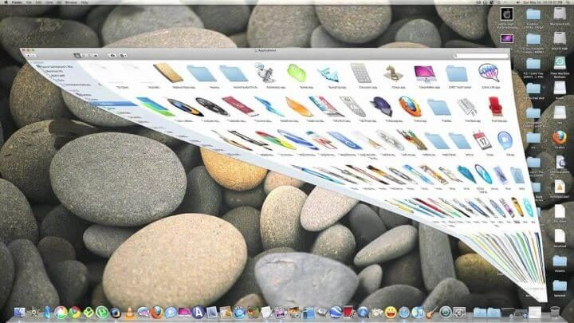
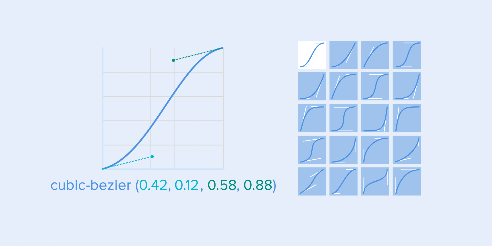

## A Generic Guide to Motion Techniques and Animation in UX/UI

 - GIF Source: 2017 Material Design (Deprecated)
 - [Article Source: The ultimate guide to proper use of animation in UX, Taras Skytskyi](https://uxdesign.cc/the-ultimate-guide-to-proper-use-of-animation-in-ux-10bd98614fa9)

### 0. Preface

- Moderation and Proper Use

UI animations are one of the most controversial areas of screen design. Many people just want to use animations because they look cool. I don’t recommend that. Others use them to communicate how the interface works, or have some [emotional](https://uxstudioteam.com/ux-blog/emotional-design/) impact on the users.

Google’s [material design guide](https://material.io/) has a wise, moderate standpoint of animations, but even some Google products use them so heavily, it is annoying.

The first and most important rule: **don’t use animations for just the sake of animations.** We human beings psychologically trend to focus on moving objects. We needed this reflex to survive when a tiger surprised us in the jungle.

It’s easy to distract people with some moving objects from their original goals. So you have to be very careful with motion, and use it with purpose. Every animation has to be meaningful. 

Animation can naturally catch users' attention. It can help **bring users' visual and psychological focus from UI element A to UI element B**. Moreover, when applied properly, it can create an easing and pleasing effect. 

Animations can explain how your interface works. One of the well-known examples is how you minimize the window in your desktop operating system. The window shrinks down to an icon on the tray, so you will know where to find it later.

---

Nowadays it’s hard to impress or even surprise with an interface animation. It shows interactions between screens, explains how to use the application or simply directs a user’s attention. While exploring the articles about animation, I found out that almost all of them describe only specific use cases or general facts about animation, but I haven’t come across any article where all rules concerning animation of interfaces would be clearly and practically described. Well, in this article I won’t write anything new, I just want to collect all the main principles & rules in one place, so that other designers who want to start animating interfaces don’t have to search for additional information.

---

### 1. Duration and speed of the animation

When elements change their state or position, the duration of the animation should be slow enough to give users the possibility to notice the change, but at the same time quick enough not to cause waiting.

*Use proper duration in your animation. Don’t make it too fast and don’t leave the user enough time to yawn*

---

[Numerous researches](https://valhead.com/2016/05/05/how-fast-should-your-ui-animations-be/) have discovered that optimal speed for interface animation is between 200 and 500 ms. These figures are based on the particular qualities of the human brain. Any animation shorter than 100 ms is instantaneous and won’t be recognized at all. Whereas the animation longer than 1 second would convey a sense of delay and thus be boring for the user.

*Duration of the animation you should better have in your interfaces*

---

On the mobile devices, [Material Design Guidelines](https://material.io/design/motion/speed.html#duration) also suggests limiting the duration of animation to 200–300 ms. As for tablets, the duration should be longer by 30% — around 400–450 ms. The reason is simple: the size of the screen is bigger so objects overcome the longer path when they change position. On wearables, the duration should be accordingly 30% shorter — around 150–200 ms, because on a smaller screen the distance to travel is shorter.

*Size of mobile devices affects the duration of the animation*

---

Web animation is treated in a different way. Since we are accustomed to an almost instant opening of web-pages in a browser, we expect to transit between different states quickly as well. So, the duration of web transitions should last about 2 times shorter than on mobile devices — between 150–200 ms. In other cases, the user will inevitably think that the computer freezes or has troubles with the internet connection.

But. Forget about these rules if you are creating a decorative animation on your website or trying to attract the user’s attention to certain elements. In these cases, animation can be longer.

*Large screen of computer = Slow animation? No way!*

---

You need to remember that regardless of the platform the duration of the animation should depend not only on the traveled distance but also on the size of the object. Smaller elements or animation with small changes should move faster. Accordingly, the animation with large and complex elements looks better when it lasts a little longer.

Among the moving objects of the same size, the first one to stop is the object that has passed the shortest distance.

Small objects in comparison with large objects are moving slower since they make bigger offsets.

*Duration of the animation differs depending on the size of the object and the traveled distance*

---

When objects collide, the energy of collision must be evenly distributed between them according to physical laws. So, it’s better to exclude the bounce effect. Use it only in exceptional cases when it makes sense.

*Avoid using the bouncing effect since it distracts attention*

---

The movement of the objects should be clear and sharp so do not use motion blur (yes, After Effects users, not this time). It is difficult to reproduce the effect even on modern mobile devices and it’s not used in interface animation at all.

*Do not use the blur effect in your animation*

---

List items (news cards, email lists, etc) should have a very short delay between its appearance. Each occurrence of the new element should last from 20 to 25 ms. The slower emergence of elements may annoy the user.

*Animation for list items should last 20–25 ms*

---

#### **1.1 Easing**

Easing helps to make the movement of the object more natural. It’s one of the essential [principles of the animation](https://vimeo.com/93206523), which is thoroughly described in the book [**The Illusion of Life: Disney Animation**](https://www.wikiwand.com/en/Disney_Animation:_The_Illusion_of_Life)**,** written by two key Disney animators — Ollie Johnston and Frank Thomas.

For the animation not to look mechanical and artificial, the object should move with some acceleration or deceleration — just like all live objects in the physical world.

*Animation with easing looks more natural compared to the linear one*

####1.2 Linear motion

Objects that are not affected by any physical force move linearly, in other words with constant speed. And just because of this fact they look very unnatural and artificial for the human eye.

All applications for animation use the animation curves. I will try to explain how to read them and what they mean. The curve shows how the position of the object `(y axis)` changes during the same time intervals `(x axis)`. In the current case, the movement is linear, so the object travels the same distance at the same time.

*The curve of linear motion*

Linear motion can, for example, be used only when the object changes its color or transparency. Generally speaking, we can use it for the states when an object does not change its position.

#### **1.3 Ease-in or acceleration curve**

We can see on the curve that at the beginning the position of the object changes slowly and the speed increases gradually. That means the object is moving with a certain acceleration.

*Acceleration curve*

This curve should be used when the objects fly out of the screen at full speed. Those can be system notifications or just cards of the interface. But keep in mind that such type of curve should only be used when the objects leave the screen forever and we cannot recall or return them.

*Acceleration curve for throwing the card out of the screen*

The animation curve helps to express the right mood. At the example below, we can see that the duration of movement and the distance for all objects is the same, but even small changes in the curve give you the possibility to influence the mood of animation.

And of course, by changing the curves, you can move the object as similar to the real world as possible.

*Same duration and distance but different moods*

#### **1.4 Ease-out or deceleration curve**

It’s opposite to ease-in curve, so the object quickly covers long distance then slowly reduces the speed till it finally stops.

*Deceleration curve*

This type of curve should be used when the element emerges on the screen — it flies up on the screen at full speed, gradually slows down until it completely stops. This can also be applied to different cards or objects that appear from the outside of the screen.

*Deceleration curve for a nice show-up*

#### **1.5 Ease-in-out or standard curve**

This curve makes the objects gain speed at the beginning and then slowly drop it back to zero. That type of movement is the most frequently used in interface animation. Whenever you doubt what type of motion to use in your animation, use standard curve.

*Standard curve*

According to [Material Design Guidelines](https://material.io/design/motion/customization.html#speed), it is better to use an asymmetric curve to make the movement look more natural and realistic. The end of the curve must be more emphasized than its beginning, so that the duration of acceleration is shorter than that of slowing down. In this case, the user will pay more attention to the final movement of the element and thus to its new state.

*See the difference between symmetric and asymmetric standard curve*

Ease-in-out is used when the objects move from one part of the screen to another. In such case, animation avoids the eye-catching and dramatic effect.

*The movement of the card on the screen and the corresponding asymmetric curve*

The same movement type should be used when the element disappears from the screen but the user can return it to the previous place at any time. It concerns the navigation drawer, among others.

*The navigation drawer hides from the screen with the standard curve*

From these examples follows a fundamental rule that many beginners neglect — the beginning animation is not equal to the ending animation. As in the case with the navigation drawer — it appears with deceleration curve and disappears with the standard curve. Besides, according to [Google Material Design](https://material.io/design/motion/speed.html#duration), the time of the object’s emergence should be longer to attract more attention.

*The appearance and disappearance of the side menu is fulfilled with deceleration and standard curve correspondently*

A function `cubic-bezier()` is used to describe the curves. It’s called cubic because it’s based on four points. The first point with coordinates `0;0` (bottom left), and the last one with coordinates `1;1` (top right) are already defined on the graph.

Based on that we need to describe only two points on the graph, which are given by four arguments of the function `cubic-bezier()`: the first two are the coordinates `x` and `y` of the first point, the second two are the coordinates `x` and `y` of the second point.

To simplify your work with curves I suggest using sites [easings.net](http://easings.net/) and[ cubic-bezier.com](http://cubic-bezier.com/). The first one contains the list of the most frequently used curves, parameters of which you can copy to your prototyping tool. The second source gives you a possibility to play with different parameters of the curve and immediately see how the objects will move.

*Different types of curves and their parameters for the function cubic-bezier ()*

### **2.0 Choreography in interfaces animation**

Just like in ballet choreography, the main idea is to guide the user’s attention in one fluid direction during the transition from one state to another.

There are two types of choreography — equal and subordinate interaction.

#### **2.1 Equal interaction**

Equal interaction means that the appearance of all objects obeys to one particular rule.

In that case, the appearance of all cards is perceived as one flow that guides user’s attention in one direction, namely from the top to down. If we don’t follow the order, the user’s attention will be scattered. The appearance of all elements at once would look bad as well.

*User’s attention should be guided in one fluid direction*

As for the tabular view, it’s a bit more complicated. Here the user’s focus should be directed diagonally, so showing elements one by one is a poor idea. Revealing each element one by one will make animation excessively long, and the user’s attention will be zigzag-like, which is wrong.

*Diagonal appearance for the tabular view of cards*

#### **2.2 Subordinate interaction**

Subordinate interaction means that we have one central object which attracts all user’s attention, and all other elements are subordinate to it. This type of animation gives the sense of order and draws more attention to the main content.

In other cases, it would be very difficult for the user to know which object to follow so his attention would be dispersed. Therefore, if you have several elements that you want to animate, you need to clearly define the sequence of their motion and to animate as minimum objects as possible at one time.

*It is worth animating only one central object and all the rest subjecting to it. Otherwise, a user wouldn’t know what object to follow*

According to [Material Design](https://material.io/design/motion/customization.html#movement), when the moving objects transform their size disproportionally, they should move along the arc rather than in a straight line. It helps making the movement more natural. By “disproportionally” I mean that the change of height and width of the object by increase/decrease is carried out asymmetrically, that is with different speed (for example, a square card turns into a rectangle).

*The motion of an object that disproportionately changes its size should be arranged along an arc*

The movement along the line is used when the object changes its size proportionally. Since the implementation of such movement is much easier, the rule of disproportional arc movement is often neglected. Looking at the real examples of applications, you’ll see the domination of the linear movement.

*Proportional change of the size is fulfilled in a straight line*

The motion on the curve can be achieved in two ways: the first called **Vertical out** — object starts moving horizontally and ends with a vertical movement; the second — **Horizontal out** — object begins to move vertically and ends with a horizontal motion.

The path of the object’s movement along the curve must coincide with the main axis of the scrolling interface. For instance, on the next image we can scroll interface up and down and accordingly the card unfolds in a **Vertical out way** — at first to the right and then down. The reverse movement is done in the opposite way — that is the card first rises vertically and ends up moving horizontally.

*The direction of unfolding/folding the card should coincide with the axis of the interface*

If the paths of the moving objects intersect one another, they cannot move through each other. The objects should leave enough space for the movement of another object by slowing down or accelerating their own speed. Another option — they just push away other objects. Why that? Since we assume that all objects in the interface lie in one plane.

*During movement, objects shouldn’t pass through each other, but leave space for the movement of another object*

In another case, the moving object can rise above other objects. But again no dissolving or movement through other objects. Why? Since we believe that the elements of the interface behave in accordance with the laws of physics, and no solid objects in the real world are capable of doing that.

*Objects can rise above other objects and then move*

### **Conclusions**

So, if we sum up all of the above-mentioned rules and principles, the animation in the interface should reflect the movements that we know from the physical world — friction, acceleration, etc. Imitating the behavior of objects from the real world we can create a sequence that allows users to understand what to expect from the interface.

If the animation is built correctly, then it is unobtrusive and does not distract the users from their goals. If it does, you either need to soften it or even remove at all. That means that the animation shouldn’t slow down the user or prevent from performing the task.

But do not forget that animation is more of an art than science, so it’s better to experiment and test your decisions on users.